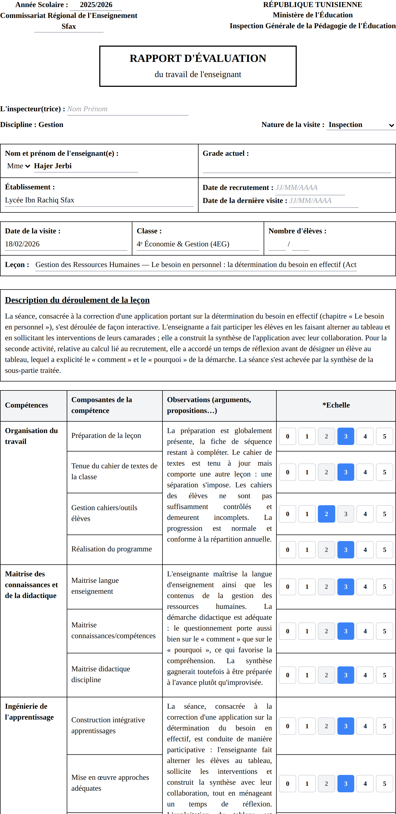

# Rapport d'Inspection — Gestion

[-1d4ed8?style=for-the-badge&logo=windows&logoColor=white)](https://github.com/haythembenjima/rapports/releases/latest/download/Rapport-Inspection-Setup.exe)
[-3DDC84?style=for-the-badge&logo=android&logoColor=white)](https://github.com/haythembenjima/rapports/releases/download/android-v1.7.6/Rapport-Inspection.apk)

> **⬇️ Windows :** [**Installateur (.exe)**](https://github.com/haythembenjima/rapports/releases/latest/download/Rapport-Inspection-Setup.exe) — lien toujours à jour (dernière version).
> **📱 Android :** [**Application (.apk)**](https://github.com/haythembenjima/rapports/releases/download/android-v1.7.6/Rapport-Inspection.apk) — installez puis autorisez les « sources inconnues ».
> &nbsp;·&nbsp; [Toutes les versions](https://github.com/haythembenjima/rapports/releases)

Application de rédaction des rapports d'évaluation d'inspection pédagogique
(discipline **Gestion**, modèle officiel du Ministère de l'Éducation tunisien).



L'application est un **fichier unique** : [`index.html`](./index.html).
Elle fonctionne de trois façons :

| Usage | Comment |
|-------|---------|
| **Navigateur** | Ouvrir `index.html` (ou l'héberger sur un site statique). |
| **Application de bureau Windows (.exe)** | Voir ci-dessous. |
| **Hors ligne** | Les données sont stockées localement si Firebase est indisponible. |

## Fonctionnalités

- Grille d'évaluation officielle (6 compétences, 20 indicateurs, échelle 0–5).
- **Note /20 calculée automatiquement** selon l'échelle, **modifiable à la main**.
- Observations par compétence générées dans le jargon d'inspection.
- **Synthèse** automatique (règles) ou assistée par IA (Gemini), accordée au genre.
- Reformulation IA de la description de la séance.
- **Export PDF** et **export Word (.docx)**.
- **Historique** des rapports (Firebase ou local), recherche, statistiques, export CSV.
- **Export par lot** : un bouton « Tout » génère un **seul fichier Word** regroupant tous les rapports affichés (un par page).
- **Import** d'un rapport au format `.json` (pour le retrouver dans l'historique).
- **Banque de phrases éditable** : le langage des *observations* et des *recommandations* est exportable/importable en JSON ; plusieurs variantes par niveau (0–5) sont tirées au hasard pour éviter les répétitions (onglet Historique → *Banque de phrases*).
- **Notes manuscrites → rapport** : **Prendre une photo** (mobile), **charger des images** ou **charger un PDF** (notes scannées — chaque page est convertie en image) des prises de notes de la visite.
  - **En ligne** : l'IA multimodale (Gemini) lit les images et pré-remplit description, observations par compétence, **note /20 proposée** et synthèse.
  - **Hors ligne** : reconnaissance du texte sur l'appareil (OCR), puis génération **à partir de la banque de jargon** (observations, **note /20 estimée**, synthèse) — fonctionne aussi sur du texte saisi/corrigé à la main. Dans l'**installateur Windows**, le moteur OCR (Tesseract + données françaises) est **embarqué** → reconnaissance **100 % hors-ligne** dès l'installation. *(En version navigateur, l'OCR se télécharge une fois depuis le CDN puis est mis en cache.)*

## Construire l'application Windows (.exe)

### Option A — Automatique (GitHub Actions, recommandé)

À chaque push sur `main`, le workflow [`build-windows.yml`](./.github/workflows/build-windows.yml)
construit l'installateur sur une machine Windows et le publie comme **artifact**
téléchargeable depuis l'onglet **Actions** du dépôt. On peut aussi le lancer
manuellement (*Run workflow*).

### Option B — En local sur Windows

Prérequis : [Node.js](https://nodejs.org) installé.

```bash
npm install
npm run dist          # crée dist/Rapport-Inspection-Setup.exe (installateur)
# ou
npm run dist:portable # crée une version portable (.exe sans installation)
npm start             # lance l'app en mode développement
```

L'installateur généré (`dist/*.exe`) s'installe comme un logiciel Windows classique
(raccourci bureau + menu Démarrer).

> Remarque : certaines fonctions (synchronisation Firebase, IA Gemini, polices/CDN)
> nécessitent une connexion Internet. La saisie, le calcul de la note, l'export
> PDF/Word et l'historique local fonctionnent hors ligne.
